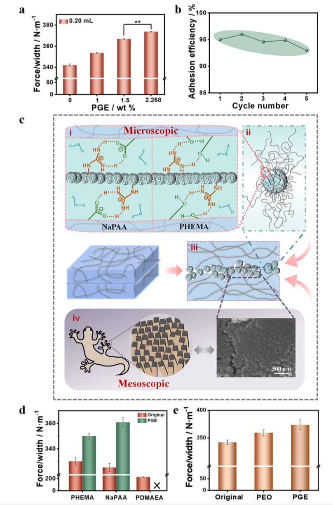
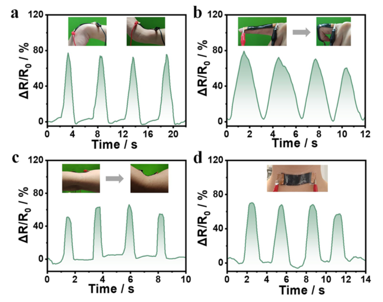

Contribution
======
<!-- 担任WuWeitai老师实验室中的研究助理，协助Dr. ZhaoTing和Dr. ZhangHaojie完成实验中数字信号处理、假设检验、显著性分析等工作。具体包括，
1. 对原始实验数据进行FFT、去噪等数据清洗工作
2. 使用包括Wilcoxon秩和检验等非参数检验方法对粘合剂性能进行统计检验（小样本、非正态情况下）。
3. 回复审稿人关于水凝胶传感器抗剥离（peeling）性能的显著性分析的批评与建议。 -->

Served as a Research Assistant of statistic in Prof. Wu Weitai Lab, Assisted Dr. Zhao Ting and Dr. Zhang Haojie in digital signal processing, hypothesis testing, and significance analysis for ongoing experiments. Specifically, it includes: 

1. Performed preprocessing of raw experimental signals, including performing filters to denoise and smooth, and applying basic denoising procedures for downstream analysis.
2. Conducted non-parametric statistical inference (e.g., Wilcoxon rank-sum test) to evaluate adhesive performance under small-sample and non-normal settings
3. Responded to reviewers’ critiques regarding the statistical significance of hydrogel sensor anti-peeling performance

 

Abstract
======

With the emergence of human-computer interaction and related fields, how to realize tunable adhesion on wet and soft materials has become an important issue. In this letter, we propose a strategy for tunable wet adhesion by leveraging the phase transition of polymeric nanoparticles to achieve dynamic, multiscale, and multifactorial synergistic modulation. The strategy is validated by using stimuli-responsive polymer microgel dispersions as sprayable glues, which can switch between swollen and deswollen states through phase transitions, thereby tuning interfacial water molecules. This process dynamically tunes microscopic molecular interactions and the mesoscopic contact area between microgel nanoparticles and the substrate surface, as well as the cohesion within interfacial microgel layers. As a result, adhesion is enhanced in the swollen state, reaching about 373 $ N·m^{−1}$ , while it is weakened in the deswollen state due to water release. The tunable wet adhesion is reproducible, making the sprayable microgel glues of potential interest for applications (e.g., in hydrogel-based sensors for human motion detection).

<!-- 随着人机交互及相关领域的出现，如何在湿软材料上实现可调附着力成为一个重要课题。在这封信中，我们提出了一种可调湿粘附策略，通过利用聚合物纳米颗粒的相变来实现动态、多尺度和多因素协同调制。该策略通过使用刺激响应聚合物微凝胶分散体作为可喷涂胶来验证，该胶水可以通过相变在溶胀和解凝状态之间切换，从而调整界面水分子。该过程动态调整微观分子相互作用和微凝胶纳米颗粒与底物表面之间的介观接触面积，以及界面微凝胶层内的内聚力。结果，在膨胀状态下附着力增强，达到约373 $ N·m^{−1}$，而在脱液状态下由于放水而减弱。可调湿粘合是可重复的，使得可喷涂微凝胶胶在应用中具有潜在的兴趣（例如，用于人体运动检测的基于水凝胶的传感器）。 -->

 

Some of the figs
======

    
     
    
Fig 1. 🦎
 

 

    
     
    
Fig 2.Human motion sensing. (a) Sensing of elbow bending. (b) Sensing of finger bending. (c) Sensing of arm bending. (d) Sensing of head tilting upward. 

 
 

