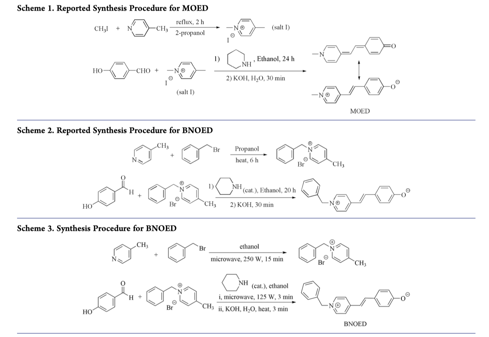
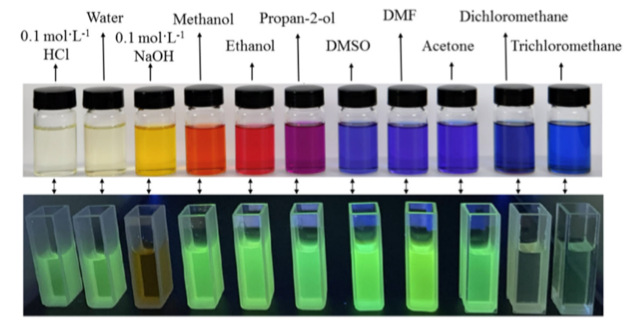
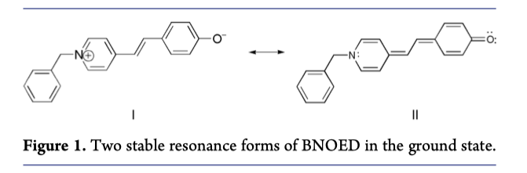

Abstract
======
Brooker’s merocyanine (MOED), a solvatochromic dye, was initially suggested as a visual indicator of solvent polarity. However, its synthesis is hindered by the use of iodomethane, a raw material with a low boiling point and high toxicity. To address these issues, benzyl bromide was employed as a substitute for iodomethane, leading to the synthesis of the MOED analogue 1-benzyl-4-\[(oxocyclohexadienylidene)ethylidene\]-1,4-dihydropyridine (BNOED). However, the lengthy reaction time of 26 h limits its practicality in a standard organic chemistry laboratory teaching. A microwave-assisted method reported in this text successfully reduced the reaction time to 18 minutes. BNOED exhibits solvatochromic properties, with its maximum absorption wavelength in various solvents showing a linear relationship with the solvent’s Reichardt polarity parameter $E_{T}(30)$. Consequently, the synthesis of the solvatochromic dye BNOED is highly suitable for organic chemistry laboratory instruction at the undergraduate level. Through UV–vis and fluorescence spectroscopy, $^{1}H NMR$ spectroscopy, and visual observation, students are guided to deeply explore the principles of solvatochromism. This experiment encompasses classic organic chemistry concepts, including N-alkylation and condensation reactions. It primarily assists students in investigating the properties of the synthesized product through visual observations and data from UV–vis, fluorescence, and NMR spectroscopy. This approach encourages students to think critically and analytically, enhancing their ability to address problems in an organic chemistry laboratory course.

 

Some of The Figs
======

    
     
    
Fig 1. Synthesis Procedure
 

 

    
     
    
Fig 2. Negative Solvatochromic in Different Solvents
 

 

    
     
    
Fig 3. Mechanism for Negative Solvatochromism (Two stable resonance forms of BNOED in the ground state.)
 

