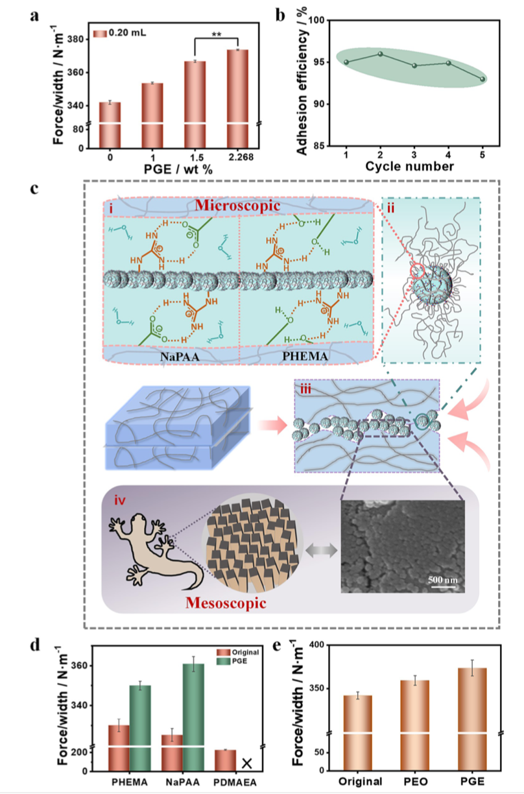
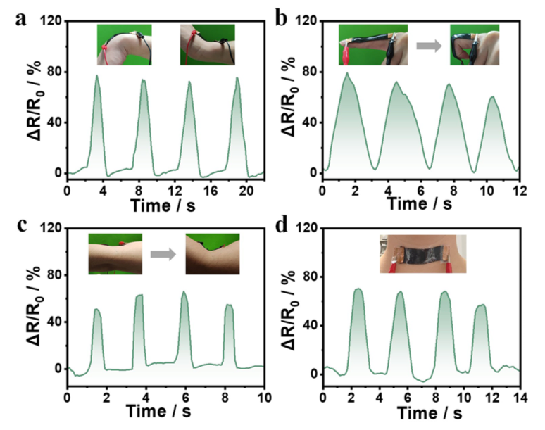

Abstract
======

With the emergence of human-computer interaction and related fields, how to realize tunable adhesion on wet and soft materials has become an important issue. In this letter, we propose a strategy for tunable wet adhesion by leveraging the phase transition of polymeric nanoparticles to achieve dynamic, multiscale, and multifactorial synergistic modulation. The strategy is validated by using stimuli-responsive polymer microgel dispersions as sprayable glues, which can switch between swollen and deswollen states through phase transitions, thereby tuning interfacial water molecules. This process dynamically tunes microscopic molecular interactions and the mesoscopic contact area between microgel nanoparticles and the substrate surface, as well as the cohesion within interfacial microgel layers. As a result, adhesion is enhanced in the swollen state, reaching about 373 $N m^{−1}$ , while it is weakened in the deswollen state due to water release. The tunable wet adhesion is reproducible, making the sprayable microgel glues of potential interest for applications (e.g., in hydrogel-based sensors for human motion detection).

Some of the figs
======

    
     
    
Fig 1. 🦎

 

    
     
    
Fig 2. 🦎

