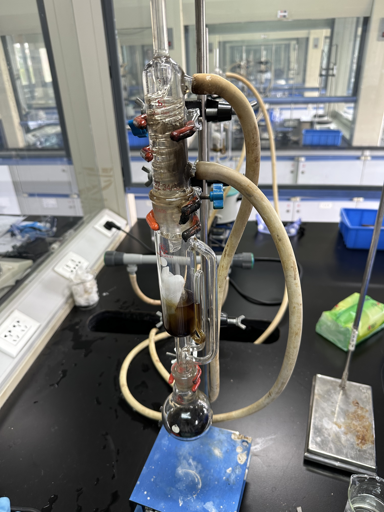
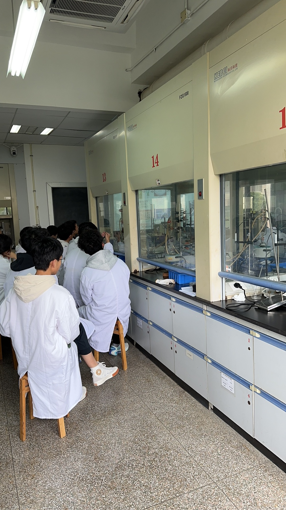
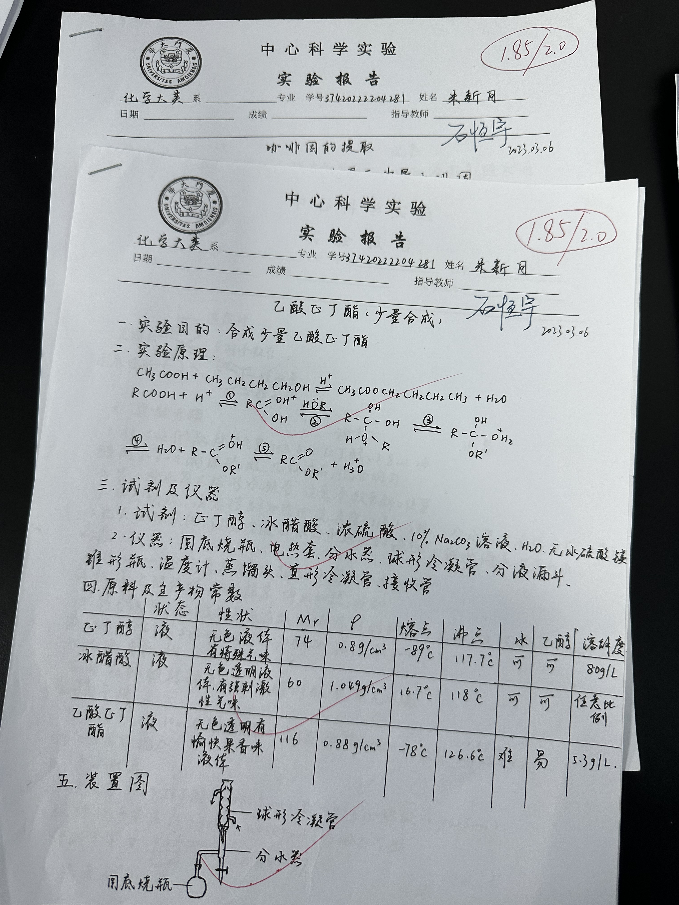
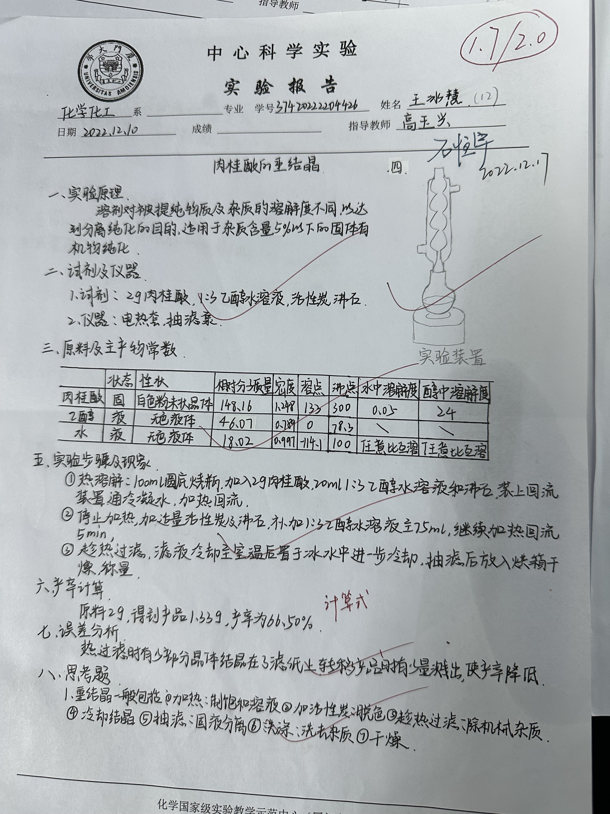
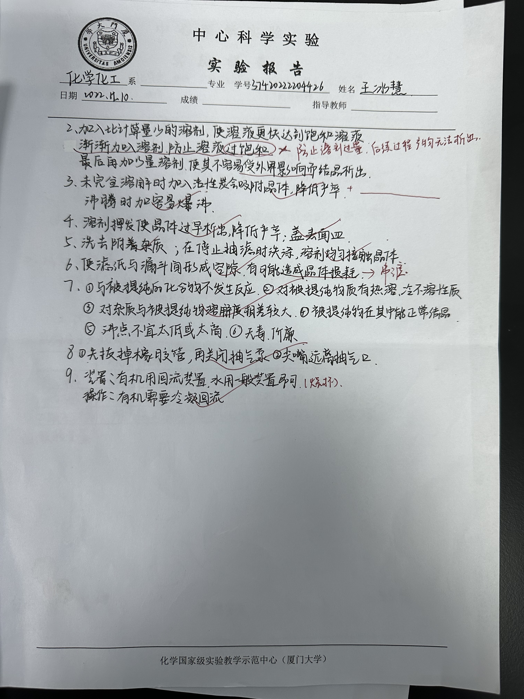
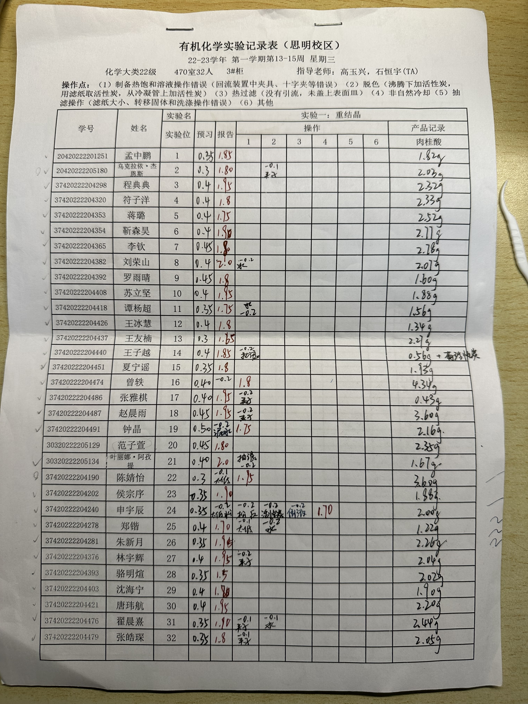
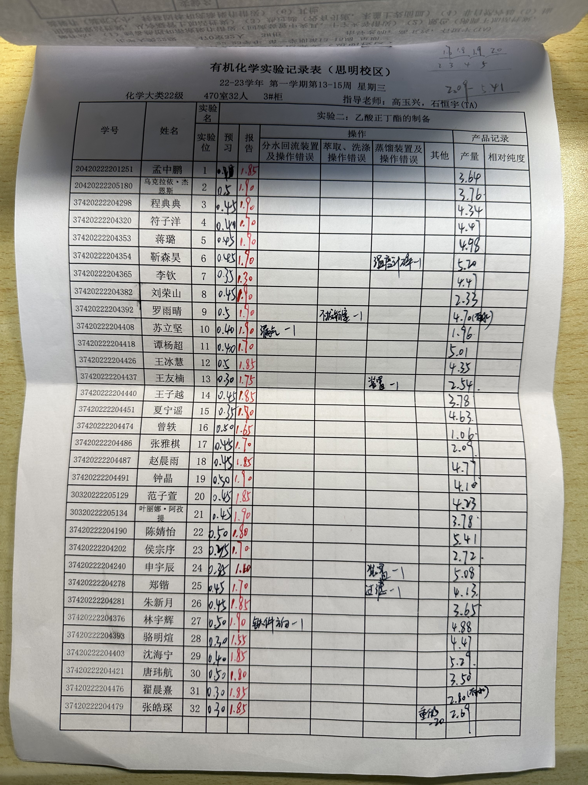

I served as a teaching assistant for the undergraduate course "Basic Chemistry Experiments" from February 2023 to July 2023, and was **the only undergraduate teaching assistant** in this course. The work mainly includes supervising students' experimental operations on site, correcting students' homework, explaining the thinking questions in the experimental report, and answering questions during office hours. It shows some photos of the time and the story behind it, and even includes **the experience of fighting the fire** 🧯🔥. 😂

Some stories 
======

    
     
    
Fig 1. 😂在肉桂酸的合成与重结晶纯化实验中，一只可怜的蚊子🦟飞进了正在发生Perkin reaction的一名同学的烧瓶 

 

    
     
    
Fig 2. 😱从茶叶中提取咖啡因的实验中，一名同学的装置起火，具体原因为蛇形冷凝管与索氏提取器链接位置没有连接好，冷凝回流的无水乙醇顺着装置缝隙流出来，滴到加热装置后起火🔥，随后我迅速的断电并用灭火毯盖灭了火焰。
    所幸这名学生的错误操作没有造成严重后果，最大的后果是由于灭火毯是用玻璃纤维制造的，非常少量的玻璃纤维扎了我的手，随后的一年我的手都偶尔会有刺痛感☹️  

 

    
     
    
Fig 3. 💤在讲解实验操作步骤与反应原理时，灰色卫衣的这位同学看起来听讲很认真，但其实是睡着了(后续把他叫醒了，因为实验安全操作问题)😂  

 
 

优秀实验报告
======

    

    
    
        
    

     
    
Fig 4-6. 批改过的部分学生的优秀实验报告，使用红色字迹进行批改，并在右上角签名留档 

 
 

学生表现记录
======

    

    
    
        
    

     
    
Fig 7-9. 部分实验学生的成绩表现（Fig 9中的4号学生和32号学生因为操作不当起火被扣了较多的分数） 

